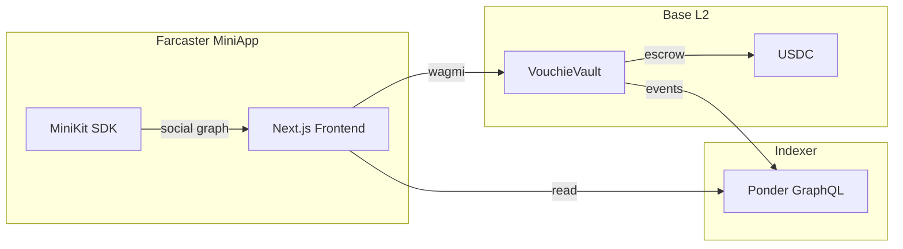

# Vouchie

> A Social Staking Protocol where Your Network Vouches for Your Goals


Vouchie transforms personal commitments into verifiable on-chain agreements. Users stake USDC against their goals and designate "Vouchies"—trusted friends who serve as decentralized verifiers. The protocol creates asymmetric incentives: succeed and claim your full stake back, fail and your Vouchies split the pot. This mechanism converts social pressure into economic alignment.

**Live on Base Mainnet. Experience made for Farcaster & Base App**

---

## Core Innovation

### The Accountability Primitive

Traditional habit apps rely on intrinsic motivation—a weak forcing function. Vouchie introduces **extrinsic economic consequences** backed by social verification:

1. **Stake-to-Commit**: Lock USDC in an escrow contract. No commitment without capital.
2. **Social Verification**: Friends vote on task completion. Farcaster's social graph replaces centralized moderators.
3. **Automatic Settlement**: Smart contract handles fund distribution. No admin keys, no trust assumptions.

### Why This Works

The protocol exploits three behavioral mechanisms:

| Mechanism | Traditional Apps | Vouchie |
|-----------|-----------------|---------|
| Loss Aversion | None | Real financial loss on failure |
| Social Pressure | Weak (notifications) | Strong (friends profit from your failure) |
| Commitment Devices | Absent | On-chain, irrevocable stake |

---

## Protocol Mechanics

### Goal Modes

**Solo Mode**: Self-verification for personal accountability. Stake goes to protocol treasury on failure.

**Squad Mode**: Designate 1-5 vouchies as verifiers. On failure:
- 90% distributed equally among vouchies
- 10% protocol fee ("Lazy Tax")

### Lifecycle

```
CREATE → [Grace Period: 10 min] → ACTIVE → [Deadline] → VOTING → RESOLUTION → SETTLEMENT
```

| Phase | Description |
|-------|-------------|
| Grace Period | Full refund cancellation window |
| Active | User works toward goal, posts proof |
| Voting | Vouchies cast valid/invalid votes |
| Resolution | Majority determines success (ties favor creator) |
| Settlement | Automatic fund distribution |

---

## Smart Contracts

Deployed on **Base Mainnet** (Chain ID: 8453)

| Contract | Address | Status |
|----------|---------|--------|
| VouchieVault | [`0xe92c78b00a4c4de034a38f156fea05276e9d90c7`](https://basescan.org/address/0xe92c78b00a4c4de034a38f156fea05276e9d90c7) | ✅ Live |
| VouchieBadge | [`0x511271d8a7e5a799936127ebfe8fe7b0674341e3`](https://basescan.org/address/0x511271d8a7e5a799936127ebfe8fe7b0674341e3) | ✅ Live |

### VouchieVault

Core escrow and voting logic. Key parameters:

| Parameter | Value | Description |
|-----------|-------|-------------|
| Lazy Tax | 10% | Protocol fee on failed goals (Squad) |
| Extension Fee | 5 USDC | Streak freeze cost |
| Extension Duration | 12 hours | Time added per freeze |
| Grace Period | 10 minutes | Free cancellation window |

---

## Architecture



### Stack

| Layer | Technology |
|-------|------------|
| Frontend | Next.js 14, TypeScript, TailwindCSS |
| Web3 | Wagmi, Viem, Scaffold-ETH 2 |
| Social | Farcaster MiniKit SDK |
| Contracts | Solidity 0.8.19, Foundry |
| Indexer | Ponder (event indexing + GraphQL) |

---

## Documentation

- [Frontend Architecture](docs/FRONTEND.md) — Component hierarchy, hooks, state management
- [Backend Architecture](docs/BACKEND.md) — Contract internals, lifecycle diagrams, Ponder schema

---

## Development

### Prerequisites

- Node.js ≥ 22.11.0
- Yarn
- Foundry

### Local Setup

```bash
# Install dependencies
yarn install

# Start local chain
yarn chain

# Deploy contracts
yarn deploy

# Start indexer
yarn ponder:dev

# Launch frontend
yarn start
```

### Testing

```bash
yarn foundry:test    # Contract tests
yarn typecheck       # TypeScript validation
```

---

## Roadmap

### v1 (Current)
- Single goal staking
- USDC on Base
- Friend verification via Farcaster
- Flip-clock countdown UI
- PnL history tracking

### v2 — Vouchie Wars
- Team vs Team challenges
- Combined stake pools
- Leaderboards and streaks

### v3 — Protocol Extensions
- **ERC-7702 Integration**: Batch approve + stake in single transaction, reducing UX friction for first-time users
- **x402 Payment Rails**: HTTP-native micropayments for automated stake deposits
- **Calendar Sync**: Google Calendar / Outlook integration for deadline imports
- **Agentic Workflows**: AI-assisted goal creation and verification scheduling
- **VouchieBadge NFTs**: Soulbound proof-of-achievement credentials

---

## License

MIT — see [LICENCE](LICENCE)