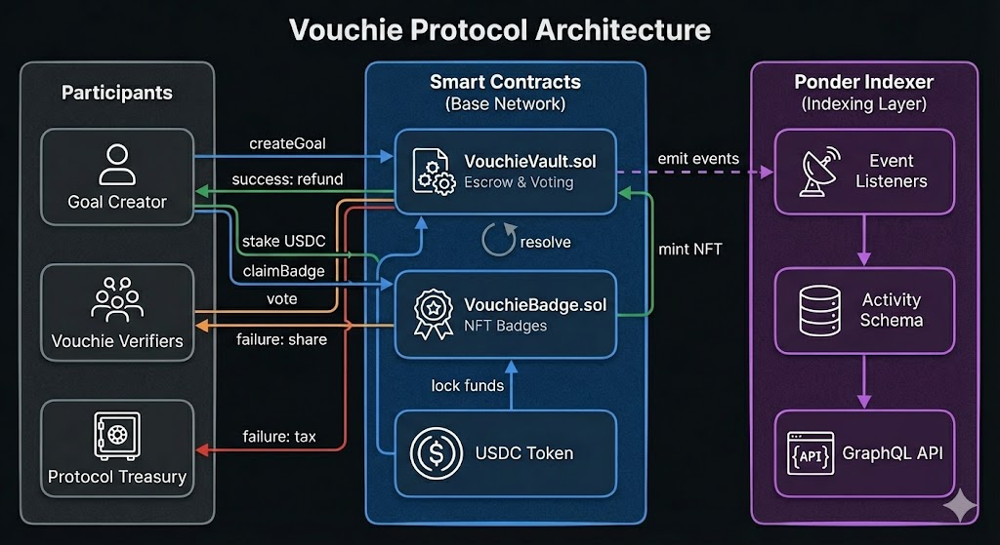
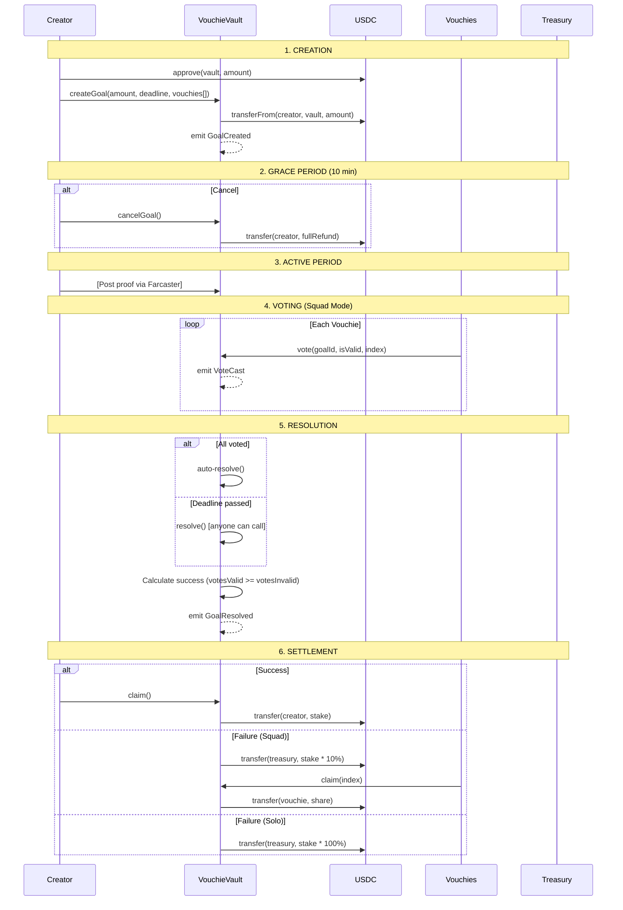

# Vouchie Backend Architecture

> Technical documentation for Smart Contracts and Ponder Indexer

## System Overview



---

## Goal Lifecycle



---

## Smart Contracts

### VouchieVault.sol

**Purpose:** Core protocol contract handling escrow, voting, and payouts

#### Configuration

| Parameter | Default | Description |
|-----------|---------|-------------|
| `lazyTaxBps` | 1000 (10%) | Protocol fee on failed goals |
| `extensionFee` | 5 USDC | Cost to extend deadline |
| `extensionDuration` | 12 hours | Time added per extension |
| `badgeFee` | 2 USDC | Cost to mint success badge |
| `CANCEL_GRACE_PERIOD` | 10 minutes | Free cancellation window |

#### Core Functions

| Function | Access | Description |
|----------|--------|-------------|
| `createGoal(amount, duration, description, vouchies[])` | Public | Lock USDC and create goal |
| `cancelGoal(goalId)` | Creator | Full refund within grace period |
| `forfeit(goalId)` | Creator | Early failure after grace period |
| `vote(goalId, isValid, vouchieIndex)` | Vouchies | Cast verification vote |
| `verifySolo(goalId)` | Creator | Self-verify (Solo mode only) |
| `resolve(goalId)` | Public | Force resolution after deadline |
| `claim(goalId, vouchieIndex)` | Eligible | Claim refund/share |

#### Settlement Logic

| Scenario | Creator Gets | Vouchies Get | Treasury Gets |
|----------|--------------|--------------|---------------|
| Solo Success | 100% refund | N/A | 0% |
| Solo Failure | 0% | N/A | 100% |
| Squad Success | 100% refund | 0 | 0% |
| Squad Failure | 0% | 90% ÷ n | 10% |

---

### VouchieBadge.sol

**Purpose:** ERC-721 NFT for verified achievements

| Function | Description |
|----------|-------------|
| `mint(to)` | Called by VouchieVault after badge fee paid |
| `tokenURI(tokenId)` | Returns badge metadata (customizable) |

---

### MockUSDC.sol

**Purpose:** Test USDC for local development (18 decimals)

---

## Ponder Indexer

### Event Listeners

Located in `packages/ponder/src/VouchieVault.ts`

| Event | Indexed Data |
|-------|--------------|
| `GoalCreated` | goalId, creator, stake, deadline, isSolo |
| `VoteCast` | goalId, voter, isValid |
| `GoalResolved` | goalId, successful, isSolo |
| `FundsClaimed` | goalId, claimant, amount |
| `GoalCanceled` | goalId, creator, refundAmount |
| `StreakFrozen` | goalId, newDeadline, feePaid |
| `BadgeClaimed` | goalId, creator, tokenId |

### Schema

```typescript
// packages/ponder/ponder.schema.ts
table activity {
  id          string primary key
  type        string    // event type
  user        string    // user address  
  goalId      string    // associated goal
  goalTitle   string    // goal description
  stakeAmount string    // original stake
  deadline    string    // goal deadline
  isSolo      boolean   // mode flag
  successful  boolean   // outcome
  claimAmount string    // amount claimed
  timestamp   string    // block timestamp
  blockNumber string    // block number
}
```
## Development Setup

### Local Development

```bash
# Terminal 1: Start local chain
yarn chain

# Terminal 2: Deploy contracts
yarn deploy

# Terminal 3: Start Ponder indexer
yarn ponder:dev

# Terminal 4: Start frontend
yarn start
```

### Network Configuration

| Network | Chain ID | USDC Decimals |
|---------|----------|---------------|
| Localhost (Anvil) | 31337 | 18 |
| Base Mainnet | 8453 | 6 |
| Base Sepolia | 84532 | 6 |

---

## File Structure

```
packages/
├── foundry/
│   ├── contracts/
│   │   ├── VouchieVault.sol    # Core protocol
│   │   ├── VouchieBadge.sol    # NFT badges
│   │   └── MockUSDC.sol        # Test token
│   ├── script/
│   │   └── Deploy.s.sol        # Deployment script
│   └── test/
│       └── VouchieVault.t.sol  # Contract tests
└── ponder/
    ├── ponder.config.ts        # Ponder configuration
    ├── ponder.schema.ts        # Database schema
    └── src/
        └── VouchieVault.ts     # Event handlers
```
