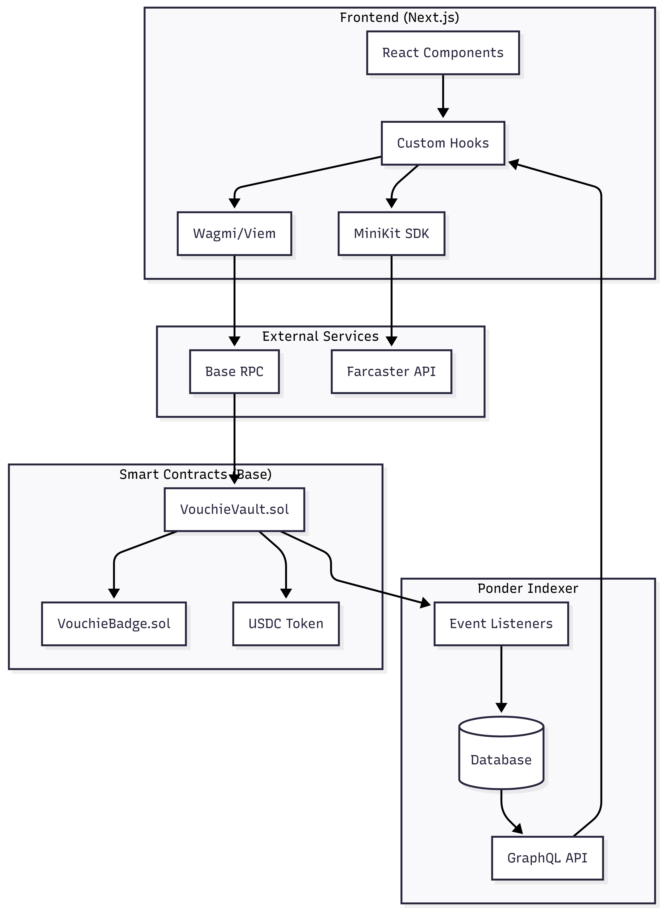
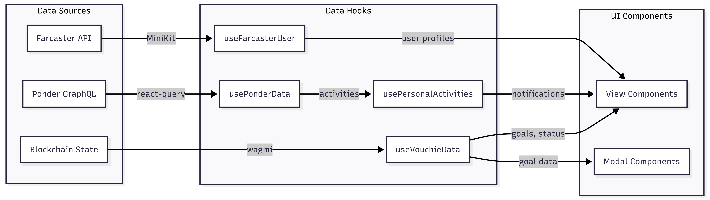

# Vouchie Frontend Architecture

> Technical documentation for the Next.js frontend application

## System Architecture Overview



---
## Data Flow


---

## Key Components

### HomeActiveView.tsx
**Purpose:** Main dashboard showing active commitment with countdown timer

| Feature | Implementation |
|---------|----------------|
| Flip Clock | Custom CSS 3D transforms with `FlipDigit` components |
| Urgency Glow | Dynamic background glow: green (>12h), amber (≤12h), red (≤1h) |
| Status Pill | Real-time status indicator with pulse animation |
| Settle Button | Disabled for Squad mode until ≥1 vote received |

**Key Logic:**
```typescript
const isCritical = timeRemaining < 1 hour
const isWarning = timeRemaining < 12 hours
const isSafe = timeRemaining >= 12 hours
```

---

### CalendarView.tsx
**Purpose:** Timeline calendar and PnL History tracker

| Tab | Features |
|-----|----------|
| Timeline | Monthly calendar with task dots, day selection, task list |
| PnL History | Transaction history with fund distribution breakdown |

**Key Features:**
- Colored dots (green/red/amber) on calendar days
- Expandable cards with fund distribution details
- Original stake lookup from Ponder when claimed

---

### FriendActivityView.tsx
**Purpose:** Activity feed with actionable notifications

| Notification Type | Action |
|-------------------|--------|
| `verify_request` | Verify button → VerifyModal |
| `claim_available` | Claim button → Contract call |
| `vouchie_invite` | View invitation details |
| `history_*` | View past activity |

---

## Custom Hooks

### useVouchieData.ts
**Purpose:** Core data aggregation from blockchain

```typescript
interface UseVouchieDataReturn {
  creatorGoals: Goal[]      // Goals where user is creator
  vouchieGoals: Goal[]      // Goals where user is vouchie
  activeGoal: Goal | null   // Most urgent unresolved goal
  upcomingGoals: Goal[]     // Sorted by deadline
  completedGoals: Goal[]    // Resolved goals
  isLoading: boolean
}
```

**Data Sources:**
- `useScaffoldReadContract` for goal count
- `useScaffoldMultipleContractData` for bulk reads
- `useFarcasterUser` for profile enrichment

---

### usePonderData.ts
**Purpose:** GraphQL queries to Ponder indexer

| Query | Purpose |
|-------|---------|
| `useActivities(limit)` | All indexed events |
| `useUserActivities(address, limit)` | User-specific events |

**Schema:**
```typescript
interface Activity {
  id: string
  type: "goal_created" | "vote_cast" | "goal_resolved" | "funds_claimed"
  user: string
  goalId: string
  stakeAmount: string
  timestamp: string
}
```

---

### usePersonalActivities.ts
**Purpose:** Transform goals into notification feed

```typescript
interface PersonalNotification {
  id: string
  type: "verify_request" | "claim_available" | "vouchie_invite" | "view" | "history_success" | "history_failure"
  title: string
  description: string
  timestamp: number
  goal: Goal
  action?: "verify" | "claim" | "view"
  amount?: number
}
```

**Logic:**
- Combines creator goals and vouchie goals
- Looks up original stake from Ponder when current stake is 0
- Generates appropriate notifications for each goal state

---

### useFarcasterUser.ts
**Purpose:** Resolve Farcaster user profiles

```typescript
interface FarcasterUser {
  fid: number
  username: string
  displayName: string
  pfpUrl: string
  verifiedAddresses: string[]
}
```

Uses MiniKit SDK to fetch user data by FID or verified address.

---

## State Management

| State Type | Solution |
|------------|----------|
| Server State | TanStack Query (React Query) |
| Contract State | Wagmi hooks with caching |
| UI State | React useState/useMemo |
| Form State | Local component state |

---

## File Structure

```
packages/nextjs/
├── app/
│   └── page.tsx              # Main app entry
├── components/
│   └── vouchie/
│       ├── HomeActiveView.tsx
│       ├── CalendarView.tsx
│       ├── FriendActivityView.tsx
│       ├── ProfileView.tsx
│       ├── GoalCard.tsx
│       ├── Modals/
│       │   ├── AddModal.tsx
│       │   ├── VerifyModal.tsx
│       │   └── TaskDetailModal.tsx
│       └── Helper/
│           └── Card.tsx
├── hooks/
│   └── vouchie/
│       ├── useVouchieData.ts
│       ├── usePonderData.ts
│       ├── usePersonalActivities.ts
│       └── useFarcasterUser.ts
└── types/
    └── vouchie.ts            # TypeScript interfaces
```
